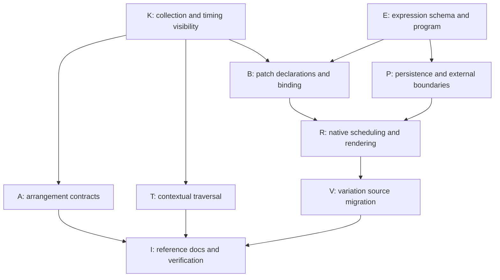

# Composer friction

This is the canonical log of live, unresolved engine and language issues that we
can fix in muz. Record defects and limitations in language semantics, synthesis,
rendering, diagnostics and exposed primitives, including cases that distort
musical choices or force repetitive editing. A valid workaround does not close a
report.

External model quality, provider availability, skill tooling and development
process reports do not belong here.

Commit a report in the same commit as the piece or revision that exposed it. For
work without a piece, name the task and commit the report with that work. Each
entry names its origin, observed behavior, affected decision/work, workaround,
and desired behavior. Include a small reproduction when useful; do not freeze a
whole composition as a test.

Remove an entry in the same commit that resolves the engine or language issue,
after verifying the reported use case. If only part is fixed, keep the remaining
problem explicit. Put usage in reference docs and
regressions in focused tests. Git history retains reports and their fixes; this
file has no resolved section, remedy archive, or parallel per-piece log. A piece
commit that encounters no new friction needs no ceremonial report. Fixes found
and completed within the same commit need no artificial live entry.

## Choosing a resolution

For every friction item, seek a general solution that expands the builtins/kernel
as little as necessary while fully resolving the reported problem. Start by
asking whether existing language operations and exposed data can express the
solution clearly. Put reusable policies and recipes in `std/`; keep particular
musical choices in project source and demonstrate useful techniques in examples.

When source cannot express the solution well, identify the missing general
capability. Prefer a small, composable primitive or better access to musical data
that enables a family of source-level solutions over a builtin for the reported
special case. Keep policy choices such as shapes, selection rules and overlap
behavior in source wherever practical. Kernel changes remain appropriate for
engine defects, runtime guarantees, or capabilities that genuinely require them;
minimizing the kernel must not mean retaining awkward workarounds or merely moving
complexity into every composition.

In the fixing commit, explain why existing facilities suffice or why the added
primitive belongs in the kernel, and demonstrate the specific resolution in
source. Tag-derived automation is one example of this general rule: expose note
data and timing operations, then let composers write the automation recipes.

## Open reports

### Source-level span contracts are repeated composition boilerplate

**Origin:** External composer handoff covering `neon-on-repeat.muz`,
`know-better-v3.muz`, `the-name-it-could-not-swallow.muz`,
`borrowed-morning.muz`, and `until-the-street-runs-out-v2.muz`.

**Observed behavior:** `a.passage(span, ...)` requires a positive logical span
and `a.sequence` advances by that span, but no opt-in contract checks whether
local material fits within it. Muz also has no reusable exact-span assertion for
ordinary patterns. A passage declared as `4b` with an `8b` part is accepted and
its material overlaps the next occurrence. Calling `a.require_span(...)` fails
because the helper does not exist. The existing permissive passage behavior is
valid for pickups and release tails and should remain available.

**Affected decision/work:** Form-driven pieces repeatedly define local helpers
that assert every part fits its passage and that phrases, bars, couplets, or
whole sections have the expected span. Without those guards, a phrase edit can
shift later material or bleed into the next occurrence instead of failing near
the authored source.

**Workaround:** Each score defines assertion wrappers around `pattern.span`,
usually once for exact phrase spans and again while constructing strict
passages.

**Desired behavior:** Provide reusable, opt-in source-level span contracts for
exact span and containment. Containment must be able to distinguish attacks,
release tails, and pickups so strict form checks do not replace the existing
permissive semantics.

#### Planned resolution: source span contracts

**Decision:** Keep `passage` and `sequence` permissive. Add three opt-in helpers
to `std/arrange.muz`; logical span and performed containment are separate
contracts, not alternate interpretations of `pattern.span`.

- `require_span(pattern, expected)` returns the unchanged pattern if its logical
  span equals `expected`, otherwise fails. Compare beat quantities exactly;
  trailing rests count. Require a nonnegative beat duration.
- `require_fit(pattern, limit)` similarly checks logical span `<= limit`.
  It does not inspect attacks or releases. Require a nonnegative beat duration.
- `require_contained(material, pickups=false, tails=false)` returns a passage
  with a deferred containment contract. It does not imply logical fit; use the
  first two helpers on parts when that is also required.

`require_contained` checks every part layer, including duplicate part IDs, using
the final placed material and complete tempo map. For passage clock bounds
`begin = seconds_at(context.start, timing)` and
`end = seconds_at(context.start + context.span, timing)`:

- Note attack: `seconds_at(n.at, timing) + n.offset`.
- Note key release: `seconds_at(n.at + n.duration*n.gate, timing) + n.offset
  + n.release_offset`.
- Control/raw event start: `seconds_at(event.at, timing) + event.offset`.
- Starts must be `< end`, and must be `>= begin` unless `pickups=true`.
  Releases must be `<= end` unless `tails=true`. A permitted pickup may release
  before `begin`. `tails` never permits a late attack or control/raw event.
- Empty material passes containment; it still has its authored logical span.
  Release means scheduled key release, not an instrument's acoustic decay or
  effect tail. Existing engine validation still owns release-after-attack rules.

**Implementation anchors:** `std/arrange.muz` already has `context`,
`placed_parts`, nested `group` gesture wrapping, and `build`'s complete timing
assembly. Add a `contracts` list to passage records, preserve it through
`occurrence`/`edit`, wrap child contracts in `group` like child gestures, and
execute contracts before gesture generation in `build`. Read final child part
slots, not captured pre-edit patterns. Errors identify occurrence, part and
boundary class; do not freeze full diagnostic wording in tests.

`std/mix.muz::note_start`/`note_end` and `src/compile.rs` establish the timing
formulas above. Do not approximate with a passage-local BPM or add arbitrary
boundary tolerances. The same material can pass in one occurrence and fail in
another after tempo changes and second-valued offsets.

**Explicit timing limit:** Clock clips store private `Note.clock` timing while
public note records contain beat placeholders. Add the read-only
`pattern.has_clock_timing` boolean in `src/lang/eval.rs`, computed from existing
note payloads without changing note records or serialization. Performed
containment rejects such a part with a specific unsupported-clock-timing
diagnostic; it must not certify placeholder times. Logical checks and ordinary
uncontracted clips retain their existing behavior. Full clock-clip containment
is not part of this ordinary-pattern contract.

**Acceptance for nodes K and A below:**

- The reported 4b passage with an 8b phrase fails an opted-in contract; the
  same uncontracted passage still builds. Exact span includes trailing rests.
- Starts at the upper boundary fail; releases exactly at it pass. Gate-shortened
  releases distinguish logical fit from performed fit.
- Independently exercise pickup and tail allowances, including offsets that
  cross a boundary despite in-range score coordinates; late attacks still fail
  with tails enabled.
- Reused occurrences across tempo changes use final timing. Nested group edits
  are checked against final child slots, without checking unrelated siblings.
- Control/raw boundaries, empty layers, duplicate-ID layers and clock rejection
  behave as specified. Existing permissive pickup behavior remains unchanged.

### Native voice patches cannot name custom per-note controls

**Origin:** External composer handoff from `borrowed-morning.muz` and
`until-the-street-runs-out-v2.muz`.

**Observed behavior:** Note expression accepts only `volume`, `pan`, `tuning`,
`vibrato`, `expression`, `brightness`, and `pressure`. Both
`s.expression("mute")` and `.express({mute: 1})` are rejected as unknown note
expressions, even for native voice patches.

**Affected decision/work:** Source-defined instruments with note-local
dimensions such as open/muted state, pick position, vowel, or articulation must
mislabel one as a fixed MPE-style expression. The affected ukulele patches use
`pressure` to mean open versus muted, consuming that lane and making the source
misleading. `std/instrument.variation` likewise occupies `pressure` for a stable
variation stream.

**Workaround:** Repurpose a semantically unrelated expression lane, split the
material across instruments or tracks, or omit the expressive dimension.

**Desired behavior:** Let native voice patches declare and consume named
per-note controls while retaining the standard expression names and their
external CLAP/MPE semantics. Custom controls do not need implicit export to
formats that cannot represent them.

#### Planned resolution: declared native note controls

**Decision:** Extend the existing expression write/read surfaces, not the
language syntax or the graph operation vocabulary:

```muz
voice_patch("pluck", {
    note_controls: {mute: 0, pick_position: 0.5},
    output: s.mul([s.saw(), s.expression("mute")])
})
// On material sent to that patch:
phrase("C4:q E4:q").express({
    mute: 1,
    pick_position: [[0, 0.2], [1, 0.8]]
})
```

The graph is illustrative; musical mapping of mute, pick position, vowel and
articulation stays in source.

**Contract:**

- `note_controls` is an optional native voice-patch record mapping nonempty
  custom names to finite scalar defaults in `0..1`. Standard expression names
  are reserved. Patch-wide parameter IDs remain a separate namespace.
- Custom values use `0..1` and the existing scalar/phase-curve syntax and
  interpolation. Source graph arithmetic maps normalized values to other ranges.
  No per-control descriptor language is needed.
- Keep standard IDs `0..6`, ranges, defaults and automatic behavior unchanged.
  Bound all slots to 32: seven standard plus at most 25 custom controls. Assign
  custom IDs `7..31` by lexicographically sorted names, independent of source
  record order. Keep the existing aggregate 32 expression points per note.
- `.express` validates shape, finite values, ranges, increasing phases in
  `0..1`, and the point budget immediately. Declaration membership is checked
  at track compilation, when the destination is known. Direct note `data`
  writes must pass the same final validation.
- Both graph readers and note writes resolve against the same validated patch
  schema. An undeclared name fails with patch/track context, never silently
  drops or aliases another lane.
- Defaults initialize fresh voices and reset on mono ownership transfer.
  Existing note-addressed isolation, curve cadence, pre-first-point behavior
  and last-value-through-release behavior remain unchanged.
- Schema names/defaults are structural patch identity. A schema change replaces
  the device rather than retaining voices with reinterpreted numeric slots.
- Only native voice patches accept custom lanes. CLAP keeps its standard IDs
  and tuning compensation; preset synth/sampler support stays unchanged.
  VST3 and other unsupported destinations reject custom writes. SMF does not
  implicitly export them; explicit raw bend/pressure/poly-pressure messages
  retain their existing independent semantics.

**Implementation anchors and internal handoff:** `src/expression.rs` owns the
single schema/resolution/validation vocabulary. Retain fixed, copyable `Program`
storage and expose bounded iteration over only the kinds present in a program.
Do not replace every seven-slot scheduler scan with a 32-slot scan.
`src/patch_description.rs::ValidatedPatch` owns the checked schema, defaults
and structural comparison. `src/patch_source.rs` and `src/compile.rs` must treat
`note_controls` as patch configuration, not an ordinary numeric device parameter.
`src/lang/builtins.rs` must separate early `.express` syntax validation from
destination-aware resolution.

`src/audio/transport.rs` must use the same authored-kind enumeration for
capacity accounting and event delivery. `src/audio/device/patch.rs` resolves
expression readers once and resets preallocated per-voice storage from prepared
defaults; name lookup/allocation must not enter the audio callback.
`src/audio/engine.rs` and destination capability checks enforce declared slots.
`src/audio/clap.rs` must reject IDs above 6 even if handed a malformed direct
session. `src/snapshot.rs` and `Program` deserialization validate bounded slots
without out-of-bounds indexing; preparation additionally validates each slot
against its paired instrument. Old standard-only snapshots remain valid.

**Clean source migration:** Keep `std/instrument.variation`'s existing
`(pattern, seed=0, stream="variation")` signature and keyed-noise policy, but write
`expression.variation`, preserving other expression fields. Declare/read that
lane in `std/synthesis.lead` and `examples/modulated-lead.muz`; exercise the
indirect consumer `examples/instrument-design.muz`. Do not rename genuine
pressure uses in `std/synthesis.layered`, contrib instruments or pressure tests.
Sibling pieces are evidence, not fixtures or part of this engine cutover.

**Acceptance for nodes E, B, P, R and V below:**

- A small native graph audibly/numerically distinguishes defaults, constants
  and a changing custom curve; overlapping notes keep independent values.
  Fresh voices and mono ownership transfer both reset to declared defaults.
- Reject invalid declarations, standard-name collisions, undeclared readers
  and writes, malformed curves, and slot/point-budget overflow. Reordered
  declarations behave identically; changed schemas cannot retain old voices.
- Snapshot round-trip the highest custom slot with its patch. Malformed or
  undeclared slots fail at the proper boundary, including direct sessions.
- Scheduler accounting covers authored custom lanes at the existing expression
  cadence; delivery remains block-size independent and allocation-free.
- Exercise standard CLAP event encoding and tuning, not just a name-table
  assertion. No custom ID reaches CLAP. Existing raw MIDI bytes/timing survive
  export, with no invented custom MIDI events.
- Variation remains deterministic by key/seed/stream while leaving pressure
  available for actual pressure. Both migrated engine examples compile/render.

### Contextual note transforms require repeated whole-pattern searches

**Origin:** External composer handoff from
`until-the-street-runs-out-v2.muz` and `still-saving-your-place-v3.muz`.

**Observed behavior:** `pattern.notes` exposes note records and `map_notes`
rewrites them, but its callback receives only the current note. A transform that
needs a predecessor or successor must capture the full note list, establish an
ordering, recover the current note's position, and then select adjacent notes.
The shorter common workaround filters the entire list by end time for every
note and treats the first coincident result as the successor.

**Affected decision/work:** Selective legato, breaths, slurs, rearticulation,
and interval-sensitive performance rules duplicate verbose searches. Repeated
filtering is potentially quadratic, and choosing the first coincident note is
ambiguous once material is polyphonic.

**Workaround:** Sort and index `pattern.notes` in score source, or repeatedly
filter the captured list and rely on a monophonic-score assumption.

**Desired behavior:** Provide source-level traversal that supplies stable,
explicit predecessor/successor context and can preserve separate voice runs,
without adding a singing-specific policy.

#### Planned resolution: source traversal with indexed patch application

**Decision:** Add one general collection primitive,
`index_by(list, function)`, then implement
`map_note_runs(pattern, function, run=fn(n) => n.voice)` in `std/patterns.muz`.
Do not change `map_notes` callback arity or add a singing-specific kernel API.

`group_by`, stable `sort_by`, shared list/record values and sparse `map_notes`
already provide grouping, ordering and lossless application. The missing
operation is an efficient join from precomputed results back to original notes:
dynamic record lookup exists, but bulk construction by computed keys does not.
Repeated `filter` is quadratic; rebuilding notes from public records also loses
hidden clock-clip data and can change native event order.

**Collection contract:** `index_by` calls its key function once per item in list
order, requires string keys, and returns a record mapping each key to its
original item. Duplicate keys fail rather than silently choosing a winner.
Empty input returns `{}`. Match the existing 200,000-item collection bound and
evaluator cancellation/step limits. Use the existing record representation:
O(n log n) construction, O(log n) lookup, shared immutable values.

**Traversal callback contract:**

```muz
{note: n, previous: previous_or_null, next: next_or_null,
 run: run_key, index: index_within_run, count: run_length}
```

- Capture the original notes; evaluate `run` once per note in original order.
  Group by that key in first-occurrence order, then stable-sort each run by
  score onset `at`. Equal onsets retain original source order.
- Default grouping is the exact `voice` string. Unvoiced material is one run;
  simultaneous notes in one run have deterministic adjacency, not inferred
  melodic membership. Authors assign voices or provide a custom run function
  for independent strands. Compound keys follow `group_by`; a constant key
  requests one global run.
- `previous`/`next` are adjacent entries, not the first note touching a release,
  nearest pitch or performed-time neighbors. Offsets do not change traversal
  order. First/last boundaries are `null`; a singleton has both boundaries null.
- Invoke `function` once per context in run traversal order. It returns a sparse
  note patch or `null` to drop, exactly as `map_notes` does. No expansion API is
  added. Empty input invokes neither callback and retains its span.
- Compute all contexts/results from the immutable input before applying patches.
  Changes to `at`, `voice` or `key` cannot affect later contexts. Index results
  by the original key and apply through the existing
  `pattern.map_notes(fn(n) => by_key[n.key].patch)`.
- Preserve original native note order, omitted fields, controls/raw events,
  span and hidden payloads. Existing patch validation and duplicate-final-key
  checks remain authoritative.

**Complexity requirement:** O(n log n) collection work and O(n) intermediate
storage, excluding user callback cost. A left fold using `out + next_run`
copies a growing array and becomes quadratic with many small runs. Do not use
that implementation: concatenate run-result arrays with a balanced source-level
join over index ranges (logarithmic recursion depth), then build one index.
Stable sorting removes any need for a redundant stored source index. No
additional kernel traversal or flattening primitive is justified.

**Acceptance for nodes K and T below:**

- `index_by` supports dynamic string lookup, rejects duplicate/non-string keys
  and excessive input, and handles empty input under existing evaluator bounds.
- A three-note run exposes correct boundaries; out-of-order storage traverses
  chronological onsets while final storage order remains unchanged. Ties are
  stable. Interleaved voices never become each other's default neighbors.
- Cover unvoiced polyphony, a compound custom run and a constant global run.
  Onset/voice/key edits and dropped notes do not alter later snapshot contexts.
- Sparse transforms preserve controls, raw events, trailing silence and clip
  payloads. Clip duration edits still fail through existing patch validation.
- Use a synthetic many-singleton-run smoke case to exercise the nonquadratic
  path; review the algorithm rather than adding wall-clock or source-text tests.

## Execution graph for the open reports

**Status:** Planning only; none of the proposed APIs or changes above is
implemented by this document. These contracts are the dispatch baseline, not a
request for each subagent to independently redesign the feature. If inspection
invalidates a prerequisite, return the evidence to the integration owner before
changing a shared contract.

The graph is acyclic. Edges include genuine data dependencies and the explicit
shared-file ownership barrier at `src/lang/builtins.rs`.



### Dispatch packets and ownership

Each row is one implementation assignment, including its focused synthetic
regressions where behavior is uncertain. `I` is the integration owner. File
lists are ownership boundaries, not permission to expand scope opportunistically.

| Node | Depends on | Exclusive edit surface | Deliverable |
| --- | --- | --- | --- |
| **K — source prerequisites** | None | `src/lang/builtins.rs`, `src/lang/eval.rs`, `tests/event_transforms.rs` | Implement `index_by` and read-only `has_clock_timing` with the contracts above. No note-record schema changes or musical policies. Release both evaluator files before B starts. |
| **E — expression model** | None | `src/expression.rs`, its unit tests | Central standard/native schema, deterministic slot resolution, early syntax validation versus destination resolution, bounded copyable programs and distinct-kind enumeration. Publish concrete Rust signatures to B/P/R before they begin. |
| **A — arrangement contracts** | K | `std/arrange.muz`, `tests/arrangement.rs` | All three span helpers, final-context contract execution, nesting/edit propagation and report-specific boundary cases. No change to permissive passage semantics. |
| **T — contextual traversal** | K | `std/patterns.muz`, `tests/pattern_recipes.rs` | `map_note_runs`, balanced result concatenation and indexed sparse application; explicit voice/tie/snapshot semantics. |
| **B — source/destination binding** | K, E | `src/lang/builtins.rs`, `src/patch_source.rs`, `src/patch_description.rs`, `src/compile.rs`, `tests/patch_controls.rs`, `tests/composer_voice_gains.rs` | Declaration validation, expression reader/write binding, reserved patch field handling and schema-sensitive structural identity. Publish prepared schema/default accessors to R. |
| **P — persistence/external safety** | E | `src/snapshot.rs`, `src/audio/clap.rs`, `tests/snapshots.rs`; `src/midi.rs`/`src/smf.rs` only if an actual format-boundary change is required | Bounded deserialization/direct-session checks, standard-only CLAP capability/encoding and unchanged raw MIDI/export behavior. Reuse E's schema; do not invent a second ID table or change the snapshot format gratuitously. |
| **R — runtime delivery** | B, P | `src/audio/transport.rs`, `src/audio/device.rs`, `src/audio/device/patch.rs`, `src/audio/engine.rs`, `tests/patch_design.rs`, `tests/schedule_capacity.rs`; sampler/studio device files only for required shared-interface changes | Authored-kind capacity/delivery, native slot reads/default resets, per-note isolation and prepared-destination checks. No runtime name resolution or new audio-thread allocation. |
| **V — source cutover** | R | `std/instrument.muz`, `std/synthesis.muz`, `examples/modulated-lead.muz`, `examples/instrument-design.muz` if needed | Move only variation's writers/readers to its declared native lane; leave real pressure semantics intact. Supply example smoke commands to I. |
| **I — integration** | A, T, V | `docs/language.md`, `docs/performance.md`, `docs/synthesis.md`, `docs/production.md`, this file; cross-cutting fixes coordinated with the owning node | Reconcile references/callers, run focused acceptance once the graph is integrated, then remove only verified resolved reports and their plan nodes. |

**Scheduling:** Launch K and E together. After K, A and T can run concurrently;
after E, P can run concurrently with them. Start B only after both K and E have
handed off. R waits for B/P; V waits for R. A/T do not depend on custom controls.
If E finishes first, P need not wait for K. Do not manufacture extra barriers
from the visual rows of the graph.

**Shared batch contract:** Give each worker this log, its row, the relevant
acceptance list and already-completed dependency handoffs. All concurrent workers
skip formatters, linters, builds and test execution; they may author focused
tests. Each returns changed paths, actual API signatures, diagnostic/compatibility
decisions and exact unrun verification commands. I owns validation after edits
settle. No concurrent documentation edits; no parallel edits to the same file.
Use symbol references before exported-symbol changes and migrate every affected
caller. Escalate newly discovered shared-file edits to I for ordered ownership.

### Integration acceptance and closeout

1. Review the source contracts against the three original reports. No piece
   source, generated media or external samples become engine fixtures.
2. Run focused synthetic checks for the owned surfaces, initially:
   `cargo test --test event_transforms --test arrangement --test pattern_recipes
   --test patch_controls --test composer_voice_gains --test snapshots
   --test patch_design --test schedule_capacity --test expression_and_kits`.
   Run the expression module's unit tests as well; use the repository's actual
   names after E lands. Add a lifecycle/reload test target only if that surface
   changes. Do not run a project-wide suite independently in every worker.
3. Exercise a small source span failure/success, a contextual transform, and a
   native custom-control render through the real evaluator/compiler/engine.
   Run both migrated engine examples. Successful routine renders are sufficient;
   no automatic encode/decode round trips or full-media analysis.
4. Update canonical references: language for collections, expression validation
   and arrangement APIs; performance for contextual traversal and timing;
   synthesis for declarations/defaults/variation; production for native-only
   delivery and unchanged export limits. Document the clock-containment limit
   and unvoiced-polyphony rule explicitly.
5. Remove a report only with its complete verified resolution and reference
   updates. Remove its planning subsection and completed graph nodes/edges too;
   retain explicit remaining issues if only part is resolved. This graph must
   not become a resolved-work archive. Remove temporary smoke artifacts after
   verification. Each fixing commit explains why its kernel addition is needed
   and demonstrates the source-level policy it enables.

The planning commit itself changes only this log. Its verification is a
documentation diff/consistency review, not implementation or test execution.
